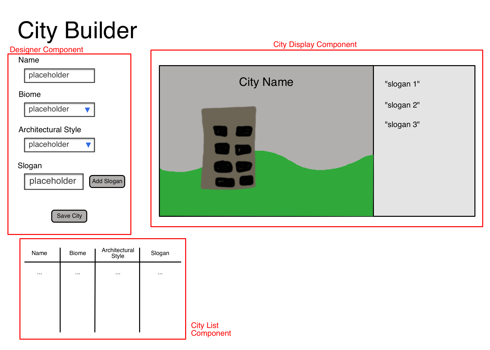

# City Builder

## Planning

### Wire frame



### Components

#### Designer Component

- State Consumed
  - `city.name`, `city.biome`, `city.style`.
- Events Generated
  - `input` event for name input element
  - `change` events for biome and architecture select elements
  - `click` events for add slogan and save city buttons

#### City Display Component

- State Consumed
  - `city.name`, `city.biome`, `city.style`, and `city.slogans`
- Events Generated
  - None

#### City List Component

- State Consumed
  - `cities`
- Events Generated
  - None

### State

We will need a `city` variable that references the city that's currently being designed, and a `cities` array of saved cities.

```js
let city = {
    name: '',
    biome: '',
    style: '',
    slogans: [],
};
const cities = [];
```

### Event Handlers

The event handlers for the the name, biome, and style elements will all update their respective values in the `city` object from the DOM content and initiate a redisplay of the city display component.

The add slogan button will read the DOM content of the textarea and append it to the `slogans` property in the `city` object, if the content is non-empty. It will also need to update the city display component.

The save city button's event handler will have to append the current city to the cities array, generate a new default city, and redisplay all three components.

### Page Load

On page load we should display all three components.
